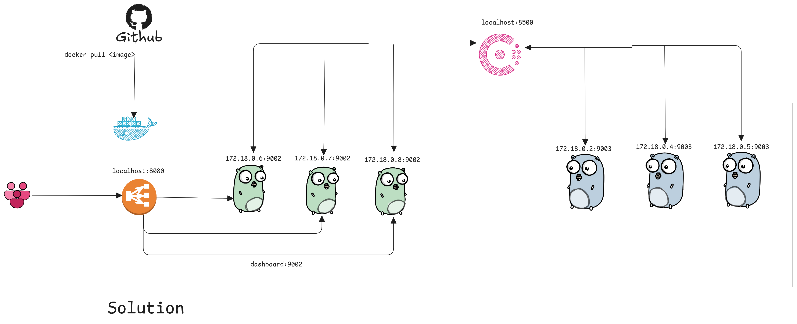
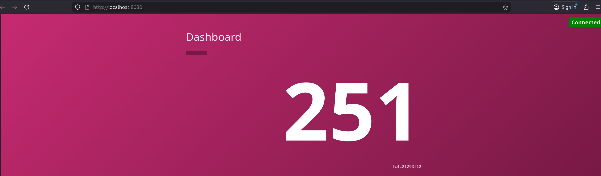
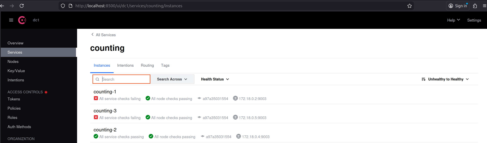
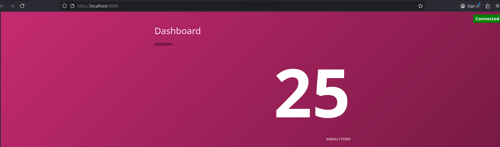

# Consul CI/CD Demo

This project demonstrates a multi-architecture Docker CI/CD pipeline. It includes a flexible load-balanced dashboard service using Nginx, leveraging Docker DNS for automatic service discovery. All services are registered in Consul for monitoring and visibility.
## Configuration


## Features
- **GitHub Actions CI/CD** builds and pushes images for:
  - Mac ARM64
  - Mac AMD64
  - Linux ARM64
  - Linux AMD64
- **Docker Compose** launches:
  - 3 `counting-service` containers
  - 3 `dashboard-service` containers
  - 1 Consul agent for service registration/monitoring
  - 1 DNSMASQ container for conditional DNS forwarding
  - 1 Nginx load balancer for dashboard service (auto-load balances all dashboard instances)
- **Automatic Consul Registration**: All service containers are registered with Consul via a custom script.
- **Flexible Service Discovery**: Nginx uses Docker DNS to dynamically route traffic to all dashboard-service containers, supporting scaling and zero manual IP configuration.
- **Conditional DNS Forwarding with DNSMASQ**: 
  - DNSMASQ acts as a conditional DNS forwarder at `172.18.0.101`
  - All service containers use DNSMASQ as their primary DNS server
  - **DNS Resolution Flow**:
    - Queries for `.consul` domains (e.g., `counting.service.consul`) → forwarded to Consul DNS at `172.18.0.100:8600`
    - All other queries (e.g., `www.google.com`) → forwarded to Google DNS at `8.8.8.8`
  - Configuration in `dnsmasq.conf`:
    - `server=/consul/172.18.0.100#8600` - forward .consul domains to Consul
    - `server=8.8.8.8` - forward other queries to Google DNS
  - Enables seamless service-to-service communication via Consul service discovery while maintaining external DNS connectivity

## Quick Start

### 1. Build & Push Images (CI/CD)
Images are built and pushed to Docker Hub automatically via GitHub Actions when `.github/workflows/*` changes.

- See `.github/workflows/docker-build-push.yml` for details.
- Images are multi-arch (arm64, amd64) and compatible with Mac and Linux.

### 2. Run the Stack

```sh
docker compose up -d --scale counting=3 --scale dashboard=3
```

This will start:
- 3 `counting-service` containers (port 9003)
- 3 `dashboard-service` containers (port 9002)
- 1 Consul agent (port 8500)
- 1 registrator container to auto-register services in Consul
- 1 Nginx load balancer for dashboard service (port 8080)

### 3. Inspect Docker Network

```sh
docker network ls
docker network inspect consul-cicd-demo_appnet
```

Example output:
```
{
  "Name": "consul-cicd-demo_appnet",
  "Driver": "bridge",
  "Subnet": "172.18.0.0/16",
  "Gateway": "172.18.0.1",
  ...
  "Containers": {
    "consul-cicd-demo-counting-1": { "IPv4Address": "172.18.0.2/16" },
    "consul-cicd-demo-counting-2": { "IPv4Address": "172.18.0.5/16" },
    "consul-cicd-demo-counting-3": { "IPv4Address": "172.18.0.4/16" },
    "consul-cicd-demo-dashboard-1": { "IPv4Address": "172.18.0.6/16" },
    "consul-cicd-demo-dashboard-2": { "IPv4Address": "172.18.0.7/16" },
    "consul-cicd-demo-dashboard-3": { "IPv4Address": "172.18.0.8/16" },
    "consul-cicd-demo-dashboard-lb-1": { "IPv4Address": "172.18.0.3/16" }
  }
}
```

### 4. Check Consul Registration

Wait a few seconds, then run:

```sh
docker logs consul-cicd-demo-registrator-1
```

Example output:
```
Registering counting-1 at 172.18.0.2:9003
 ✓
Registering counting-2 at 172.18.0.5:9003
 ✓
Registering counting-3 at 172.18.0.4:9003
 ✓
Registering dashboard-1 at 172.18.0.6:9002
 ✓
Registering dashboard-2 at 172.18.0.7:9002
 ✓
Registering dashboard-3 at 172.18.0.8:9002
 ✓

All services registered! Check http://localhost:8500/ui/dc1/services
```

You should see all services registered in the Consul UI.


### 5. Dashboard Load Balancer (Nginx)

The dashboard service is accessible through an Nginx load balancer, which provides a single entry point and automatically distributes requests across all running dashboard-service containers. Nginx uses Docker DNS for dynamic service discovery and load balancing.



### Testing Fault Tolerance by Scaling Down Counting Service

You can test fault tolerance and service discovery by reducing the number of counting-service containers. For example, you can stop containers individually:

```sh
docker stop consul-cicd-demo-counting-1
# ...or...
docker stop consul-cicd-demo-counting-3
```

Or scale down using Docker Compose:

```sh
docker compose up -d --scale counting=1 --scale dashboard=3
```

After scaling down, the dashboard will continue to work and route requests to the remaining counting-service instance automatically. Consul UI will reflect the change in registered services, and Docker DNS ensures requests are always sent to available containers.

This demonstrates the resilience of your architecture: services remain available even when some containers are stopped or removed, with no manual reconfiguration required.




