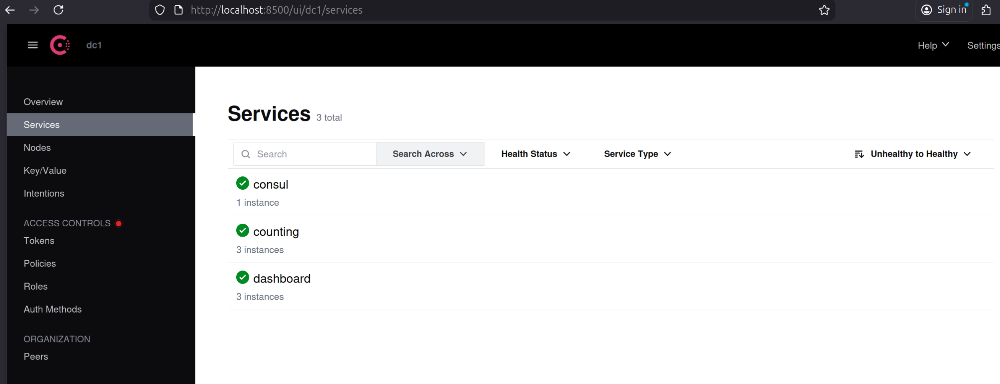

# Consul CI/CD Demo

This project demonstrates a multi-architecture Docker CI/CD pipeline. It does not implement service discovery between containers, but it does show how to register services in Consul for monitoring and visibility.

## Features
- **GitHub Actions CI/CD** builds and pushes images for:
  - Mac ARM64
  - Mac AMD64
  - Linux ARM64
  - Linux AMD64
- **Docker Compose** launches:
  - 3 `counting-service` containers
  - 3 `dashboard-service` containers
  - 1 Consul agent for service registration/monitoring
- **Automatic Consul Registration**: All service containers are registered with Consul via a custom script.

## Quick Start

### 1. Build & Push Images (CI/CD)
Images are built and pushed to Docker Hub automatically via GitHub Actions when `.github/workflows/*` changes.

- See `.github/workflows/docker-build-push.yml` for details.
- Images are multi-arch (arm64, amd64) and compatible with Mac and Linux.

### 2. Run the Stack

```sh
docker compose up -d --scale counting=3 --scale dashboard=3
```

This will start:
- 3 `counting-service` containers (port 9003)
- 3 `dashboard-service` containers (port 9002)
- 1 Consul agent (port 8500)
- 1 registrator container to auto-register services in Consul

### 3. Inspect Docker Network

```sh
docker network ls
docker network inspect consul-cicd-demo_appnet
```

Example output:
```
{
  "Name": "consul-cicd-demo_appnet",
  "Driver": "bridge",
  "Subnet": "172.18.0.0/16",
  "Gateway": "172.18.0.1",
  ...
  "Containers": {
    "consul-cicd-demo-counting-1": { "IPv4Address": "172.18.0.2/16" },
    "consul-cicd-demo-counting-2": { "IPv4Address": "172.18.0.5/16" },
    "consul-cicd-demo-counting-3": { "IPv4Address": "172.18.0.4/16" },
    "consul-cicd-demo-dashboard-1": { "IPv4Address": "172.18.0.6/16" },
    "consul-cicd-demo-dashboard-2": { "IPv4Address": "172.18.0.7/16" },
    "consul-cicd-demo-dashboard-3": { "IPv4Address": "172.18.0.8/16" }
  }
}
```

### 4. Check Consul Registration

Wait a few seconds, then run:

```sh
docker logs consul-cicd-demo-registrator-1
```

Example output:
```
Registering counting-1 at 172.18.0.2:9003
 ✓
Registering counting-2 at 172.18.0.5:9003
 ✓
Registering counting-3 at 172.18.0.4:9003
 ✓
Registering dashboard-1 at 172.18.0.6:9002
 ✓
Registering dashboard-2 at 172.18.0.7:9002
 ✓
Registering dashboard-3 at 172.18.0.8:9002
 ✓

All services registered! Check http://localhost:8500/ui/dc1/services
```

You should see all services registered in the Consul UI.

